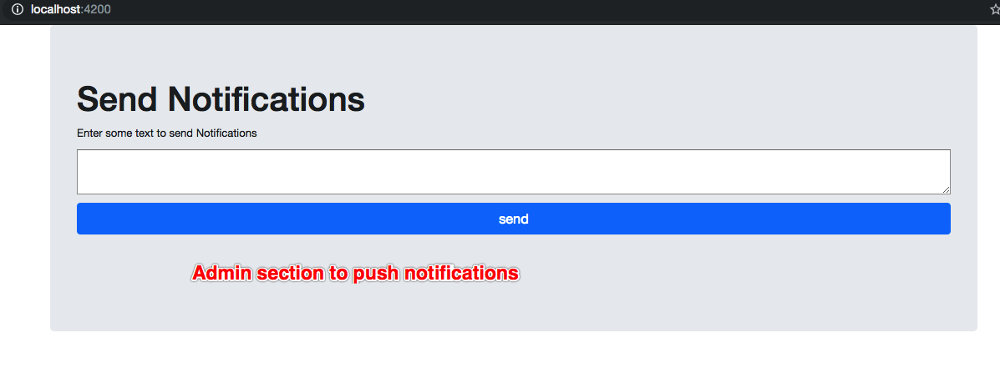
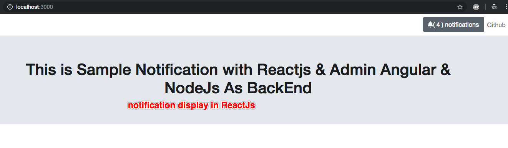

# notifications

## create reaect component CLI
https://discuss.reactjs.org/t/the-cli-to-create-react-components/5354

## install bootstrap 4
https://reactstrap.github.io/

## font awesome
https://github.com/FortAwesome/react-fontawesome

## nodemon 
global nodemon is needed to run
https://nodemon.io/
https://www.npmjs.com/package/nodemon

## HELP guide
1. ReacJs is For Notification receiver
2. AngularJs is for Pushing notifications
3. NodeJs with Socket.io is server

## get started
1. check out this repo
2. do `npm install` on `root` and `cd ./admin-push/` and `cd ./server/`
3. need to run 3 from 2 places

## starting up
1. on root `npm start` to start reactJs
2. `cd ./admin-push/ next> ng serve` to start Angular Admin section
3. `cd ./server/ next> node index.js or nodemon index.js` to start node server
4. once all up & running start pushing contents from Admin section & view in Reactjs section.

## MONGO FB
mongo DB is used from `https://mlab.com/`
So no configuration is needed.

## screen admin section

## screen react section
